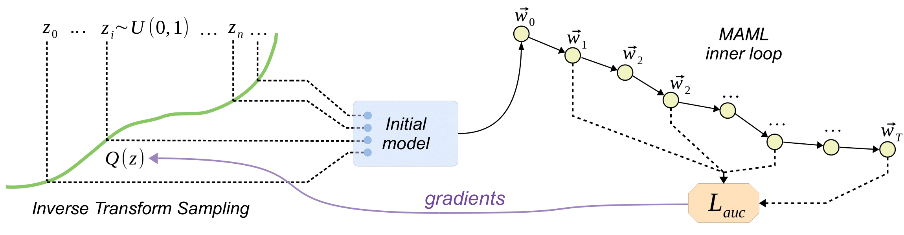

# Discovering Weight Initializers with Meta-Learning

Code for NeurIPS2020 submission.

## Overview

The approach learns initial weight distributions using MAML. Weight distributions are parametrized by quantile functions.

## Dependencies

* PyTorch >= 1.1.0
* Python >= 3.5

## Run
1. Clone or download this repo. `cd` yourself to it's root directory.
2. Grab or build a working python enviromnent. [Anaconda](https://www.anaconda.com/) works fine.
3. Install packages from `requirements.txt`
4. Open jupyter notebook in `./notebooks/` and you're done!

## Reproducibility

To reproduce results from the paper, run jupyter notebooks in `./notebooks/`.

